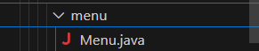

# Presentación del problema

Este proyecto surge con la necesidad de que la compañía hiperdino("Mercadona") nos pide que elaboremos una simulación de su tienda donde los que intervienen son los clientes por supuesto y las cajas dóndde los clientes serán atendidos.

Esta simulación tiene que ser lo más parecida posible a la mecánica de la tienda real. Empezando con los clientes que agarrarán los productos que van a comprar aleatoriamente sin razocinio alguno y que guardará esos productos en su cesta de la compra.

Una vez haya agarrado los productos aleatoriamente tiene que ir a pagarlos donde el cajero, el cliente tendrá que pasar por un cola para poder ser atendido por el cajero hasta llegar al final y poder ser atendido y pagar por sus productos escogidos.

Sabiendo tódo esto otra de las pista que nos dan los de hiperdino("mercadona") es que cada cesta de la compra aPILA sus productos uno encima de otro, que los clientes disponen de un nombre y su cesta y por último cada cajero que tiene un número de identificación y una COLA de clientes a las que irá atendiendo por orden de llegada a la fila.

# Solución del proyecto (MERCADONA)

Los primero que tenemos que hacer es crea unos paquetes bien estructurados y ordenados para empezar con nuestro proyecto al cuál le hemos llamado MERCADONA (no me había leído bien el enunciado y hoy me estoy dando cuenta que la cosa iba con HiperDino xdddd). Estos paquetes tienen que tener un nombre que identifique nuestras clases que participan en la simulación.

El segundo paso es desarrollar una clase la cuál hemos llamado Tienda.

Dentro de esta tendrá un método estático el cuál retornará un producto aleatorio de los que haya en la tienda, los cuáles están almacenados en una array, este array es un atributo privado estático de la clase el cuál debe tener almacenado 12 productos.

 

En las imágenes mostradas se ven los 12 productos más el método que nos devolverá aleatoriamente un producto de los de la array.

Después como paso 3 es hacer lo mismo esta vez añadiendo un método estático que devuelva un nombre aleatorio, para ello también se ha creado un atributo privado estático el cuál debe tener almacenado 20 personas, y lo que hará el método es mostrar un nombre aleatorio de las personas almacenadas en la array.

 

El método mostrado en una de las imágenes es exactamente igual que el ya mostrado en el paso anterior.

Una vez hemos terminado con la clase Tienda ahora como 4º paso tenemos que implementar a nuestro proyecto una nueva clase la cuál será llamada Cliente.

Dentro de nuestra clase Cliente, este tendrá dos atributos mínimos que son el nombre del cliente y su cesta de la compra, este último atributo será un Stack (pila en ingles).

Además de sus atributos le hicimos lo primordial que fue el constructor y sus getters and setter, aparte de todo esto, nos piden que implementemos los métodos necesarios para llamar e interactuar con la cesta de la compra. Entonces cómo metodos que implementamos fue el de otorgarle un espacio total totalmente aleatorio a la cesta dependiendo de cada cliente y uno para añadirle dependiendo del total de la cesta productos aleatorios utilizando los métodos estáticos de la clase Tienda y para que el nombre del cliente también fuese aleatorio utilizamos el método de nombreAleatorio de la clase Tienda, y por útlimo un método toString para que aparezca la info del cliente de la forma en la que nos lo pidió HiperDino.

 

Ya como paso 5 y habiendo terminado con la clase cliente tenemos que implementar otra clase esta vez llamadda Cajero.

En esta clase tendremos otros atributos el cuál será el número de identificación de la caja que se colocará manualmente y como otro atributo tenemos el de la COLA de clientes.

Y como en la clase Cliente crearemos el contructor junto a sus getters y setters y por supuesto métodos para interactuar con la fila de Clientes y nó sólo eso sino otros cuántos métodos más para la creación de la clase eecutable. Además un método toString para mostrar la info del cajero tal y como nos lo piden

Cómo último paso nos dicen los métodos que debemos crear para nuestra clase cajero. Estos son los siguientes:

1. Abrir caja: Este permitirá que el cajero abra la caja para que los clientes puedan hacer cola y el cajero poder atenderlos. Este método nos devolverá 2, además este método sirve mediante un método booleano, que si el cajero esté cerrado muestre el mensaje de que se ha abierto la caja, y si ya estuviese abierto desde antes muestre otro mensaje diciéndonos que ya estaba abierto.

2. Añadir un nuevo cliente a la cola: Este método básicamente lo que hace es generar un cliente aleatorio que será almacenado en la COLA de Clientes. Aviso importante para poder añadir a un cliente a la cola la caja primero debe estar abierta, ya que si esta no está abierta nos mostrará un mensaje que nos diga que primero debemos abrirla, hecho esto se añaderá al cliente y al cliente que haya sido añadido se verá su información de su nombre y la cesta de la compra que lleve

3. Atender un cliente: Si hay clientes en la cola el cliente que haya entrado primero en la COLA será el atendido esto usando el .poll para sacarlo de la fila y que haya sido atendido, al ser el cliente atendido se mostrará el nombre del cliente atendido. Esto si hubiesen clientes en la cola, si no los hubiesen se mostraría otro mensaje que diga que no hay clientes que atender.

4. Ver clientes pendientes: Este método nos hace ver los clientes pendientes que no han sido atendidos, básicamente nos mostrará es la información del cajero y los nombres de los clientes que quedan por atender y que están en la COLA, si no hubiesen clientes pendientes o ya hayan sido atendidos, saldrá un mensaje que nos diga que no quedan ningún cliente por atender.

5. Cerrar supermercado: Y por último el método para cerrar nuestro MERCADONA y esto lo que hará es que si está abierta la caja, la cerrará antes de cerrar el supermercado, eso sí el super no podrá ser cerrado si hay cliente en la fila por atender, para cerrar habrá que atenderlos a todos para luego poder cerrar

Y para terminar la clase ejecutable que es lo que hará que nuestro MERCADONA funcione, que básicamente es un bucle infinito siempre que nuestro atributo seguirPreguntando sea true, cuando sea false el bucle terminará junto con el programa. Dentro del bucle tendremos un switch que según la opcion que elijamos nos hará uno de los métodos según lo que diga el menú.

Hablando del menú para este cree una carpeta llamada menu

Y dentro de esta cree una clase menu

Y la clase Menu básicamente lo que tiene es un método el cual será llamado mediante un objeto menú en la clase ejecutable y este será printeado para que el usuario que use nuestro proyecto sepa que seleccionar viendo el menú que está formado de la siguiente forma y el cual cuando ejecutemos el programa es lo primero que saldrá y nosotrso tendremos que elegir entre una de esas elecciones

 

Si elegimos la opción 2 de aradir cliente nos saldrá lo siguiente

Entonces elegimos la opción 1 para abrir la caja

Si volvemos a elegir la opción 1 saldrá esto

Ahora elegiremos la opción 3

Y elegiremos la opción 4

Ahora elegimos la opción 2, 2 veces

   

Ahora elegimos la opción 4

 

Y la opción 3

Volvemos con la opción 4

Ahora la opción 5

hacemos la opción 3

Y ahora si el 5 para terminar el programa

